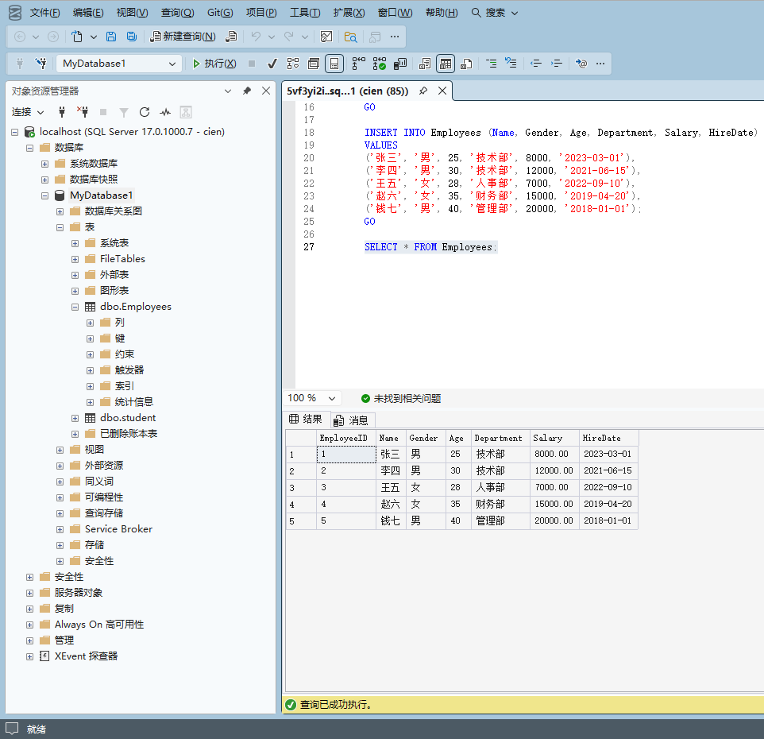

 在Visual Studio中右键项目 → **管理NuGet程序包** → 搜索并安装：**Microsoft.Data.SqlClient**

表结构

1. `SelectEmployees`查询结果

> 1 张三 8000.00
2 李四 12000.00
3 王五 7000.00
4 赵六 15000.00
5 钱七 20000.00

2.`InsertEmployee`查询结果

> 影响行数：1

3.`UpdateEmployee`查询结果

> 修改行数：1

4.`UpdateEmployee`查询结果

> 删除行数：1
